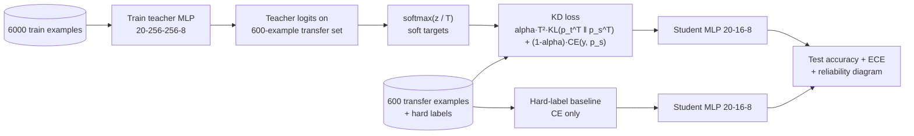

# ai-learn-22-knowledge-distillation

Knowledge distillation from scratch in NumPy. A 73k-parameter teacher MLP teaches a 472-parameter student that
only sees **600 labelled examples**. We compare training the student on hard labels with training it on the
teacher's temperature-softened outputs, sweep the temperature T, and measure accuracy and calibration (ECE).

Part of the AI learning series (after `ai-learn-11-lora-scratch` … `ai-learn-14-end-to-end-ai-assistant`).

## Architecture



## What you'll learn
- Why soft targets carry "dark knowledge" (how similar the wrong classes are) and how temperature T exposes it.
- The KD gradient `alpha·T·(p_s^T − p_t^T) + (1−alpha)·(p_s − y)` and why the loss is scaled by T².
- How to measure calibration with Expected Calibration Error and reliability diagrams.
- That distillation matters most when the student is data-starved: here it closes most of the gap to a student trained on 10x more labels.

## Layout
| file | purpose |
|---|---|
| `mlp.py` | NumPy MLP: data generator, forward/backward, Adam, train loop |
| `distill.py` | KD loss and gradient (`train_distill`), `ece`, `reliability` |
| `run_smoke.py` | Full experiment: teacher → hard-label student → T × alpha sweep → `results/` |
| `smoke_plots.py` | SVG plots + RESULTS.md writer |
| `svg_utils.py` | Makes SVGs smaller so they are easy to diff |
| `notebooks/knowledge_distillation.ipynb` | Step-by-step walkthrough |
| `results/` | `RESULTS.md`, `metrics.json`, `JSON.shot`, SVG plots from the real smoke run |

## Run
```bash
pip install -r requirements.txt
python run_smoke.py          # ~7 s on CPU, seed 42, writes results/
jupyter notebook notebooks/knowledge_distillation.ipynb
```

## Results (seed 42, from `results/metrics.json`)
| model | params | test acc | ECE |
|---|---|---|---|
| teacher | 73,224 | 0.9817 | 0.0078 |
| student, hard labels (600 ex.) | 472 | 0.876 | 0.0809 |
| student, KD T=8, alpha=0.9 (600 ex.) | 472 | **0.9383** | **0.0339** |
| student, hard labels on all 6000 (reference) | 472 | 0.9553 | 0.0065 |

T=1 barely helps (0.8787). The gains come from higher temperatures, peak at T=8 and drop off slightly at T=16.
See [results/RESULTS.md](results/RESULTS.md).

## Caveats
- Synthetic Gaussian-cluster data and one seed. Treat these as trends, not benchmarks.
- The student uses the same transfer inputs for both methods. We don't use data augmentation or unlabeled transfer data, which often helps KD even more.
- The ECE of the student trained on all 6000 labels is lower than the KD student's. Soft targets help, but they don't replace more data.

## Next steps
- Distill onto unlabeled transfer data (the teacher labels it) and grow the transfer set.
- Feature/hint distillation (match hidden layers) and self-distillation.
- Add temperature scaling after training as a calibration baseline.
