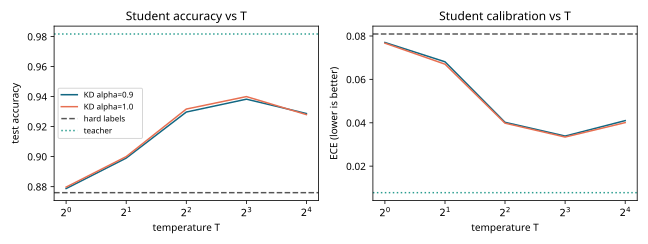
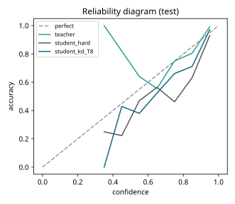
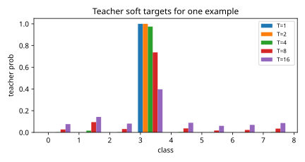

# Results: ai-learn-22-knowledge-distillation

Real output of `python run_smoke.py` (seed 42, CPU, 6.79 s wall time).

## Setup
- Teacher MLP [20, 256, 256, 8] (73,224 params) trained on 6000 examples.
- Student MLP [20, 16, 8] (472 params, 155.1x smaller) trained on a
  **transfer set of only 600 examples** for 200 epochs; same init and shuffle for every run.
- Test set: 3000 held-out examples. ECE uses 15 bins.

## Headline
| model | test acc | ECE |
|---|---|---|
| teacher | 0.9817 | 0.0078 |
| student, hard labels (600) | 0.876 | 0.0809 |
| student, KD T=1 alpha=0.9 | 0.8787 | 0.077 |
| student, KD best T=8 alpha=0.9 | 0.9383 | 0.0339 |
| student, hard labels on all 6000 (reference) | 0.9553 | 0.0065 |

## Temperature sweep
| T | alpha | acc | ECE |
|---|---|---|---|
| 1 | 0.9 | 0.8787 | 0.077 |
| 1 | 1.0 | 0.8797 | 0.0767 |
| 2 | 0.9 | 0.899 | 0.0681 |
| 2 | 1.0 | 0.9 | 0.067 |
| 4 | 0.9 | 0.9297 | 0.0402 |
| 4 | 1.0 | 0.9317 | 0.0398 |
| 8 | 0.9 | 0.9383 | 0.0339 |
| 8 | 1.0 | 0.94 | 0.0334 |
| 16 | 0.9 | 0.9287 | 0.041 |
| 16 | 1.0 | 0.928 | 0.0401 |

## Plots

## Honest notes
- The dataset is synthetic Gaussian clusters, so absolute numbers only mean something relative to each other.
- A single seed was run, so small differences (under about 0.5 pt) are within noise.
